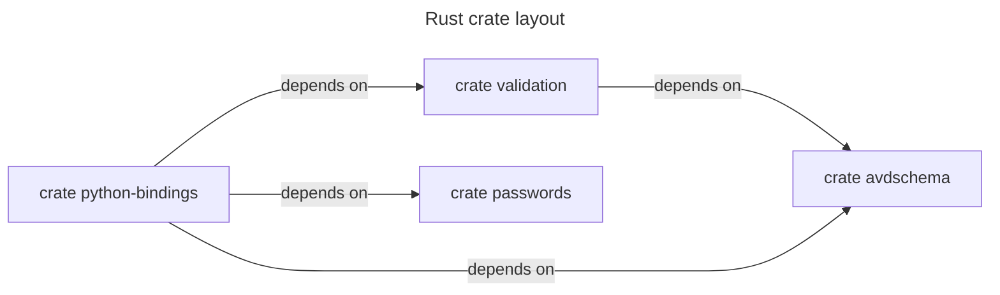

<!--
  ~ Copyright (c) 2025-2026 Arista Networks, Inc.
  ~ Use of this source code is governed by the Apache License 2.0
  ~ that can be found in the LICENSE file.
  -->



## Benchmarks

Run the Criterion-compatible benchmark suites locally from the repository root:

```bash
cargo bench --locked --workspace --all-features
```

CodSpeed uses simulation and memory analysis builds. The measurement modes must
be present when the benchmark binaries are built so the required instrumentation
is included:

```bash
cargo install cargo-codspeed --version 5.0.1 --locked
cargo codspeed build --locked --workspace --all-features --measurement-mode simulation,memory
cargo codspeed run --workspace
```

Simulation is the current name for the mode formerly called instrumentation.
The GitHub workflow uploads both simulation and memory measurements after the
Rust test matrix succeeds.
